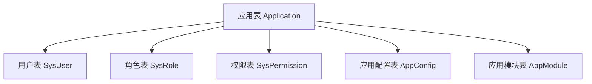

## 🏗️ 多应用 SaaS 平台完善工作清单（去除租户功能）

### 📋 **一、数据架构层改造（优先级：🔴 高）**

#### 1.1 数据库模型设计



- **新增应用表（Application）**
  - 应用基本信息（名称、标识符、描述、状态等）
  - 应用类型（Web应用、移动应用、API服务等）
  - 应用版本管理
  - 应用图标、主题配置

- **新增应用配置表（AppConfig）**
  - 应用级别的功能开关
  - 应用特定的配置参数
  - 应用主题和样式配置

- **新增应用模块表（AppModule）**
  - 模块基本信息（名称、路径、组件等）
  - 模块状态（启用/禁用）
  - 模块依赖关系

- **改造现有表结构**
  - 用户表添加 `applicationIds` 字段（用户可访问的应用列表）
  - 角色表添加 `applicationId` 字段（角色归属的应用）
  - 权限表添加 `applicationId` 字段（权限归属的应用）

#### 1.2 数据隔离策略

- **应用级数据隔离**
  - 基于 `applicationId` 的行级过滤
  - 确保用户只能访问授权应用的数据

### 📋 **二、认证授权体系重构（优先级：🔴 高）**

#### 2.1 多应用认证策略

- **JWT Token 结构调整**
  ```typescript
  interface JWTPayload {
    userId: number; // 保持与数据库字段一致
    username: string;
    iat?: number;
    exp?: number;
  }
  ```

#### 2.2 权限模型升级

- **应用级 RBAC 模型**
  - 用户在不同应用中可以有不同的角色
  - 权限基于应用进行隔离
  - 支持跨应用的统一身份认证

#### 2.3 应用切换机制

- **应用切换 API**
- **应用权限验证**
- **应用状态管理**

### 📋 **三、中间件和拦截器开发（优先级：🔴 高）**

#### 3.1 应用识别中间件

- **请求头识别**：基于 `X-App-Id` 头识别当前应用
- **路径识别**：基于 URL 路径前缀识别应用
- **Token 识别**：基于 JWT 中的 `currentAppId` 识别

#### 3.2 应用数据隔离拦截器

- **查询拦截器**：自动添加 `applicationId` 过滤条件
- **写入拦截器**：自动添加 `applicationId` 字段
- **权限拦截器**：验证用户对当前应用的访问权限

#### 3.3 应用上下文管理

- **请求级别的应用上下文**
- **应用配置的动态加载**

### 📋 **四、应用管理模块（优先级：🟡 中）**

#### 4.1 应用生命周期管理

- **应用创建和配置**
- **应用启用/禁用**
- **应用版本管理**
- **应用删除和数据清理**

#### 4.2 应用用户管理

- **用户应用授权**
- **应用角色分配**
- **应用访问权限控制**

#### 4.3 应用模块管理

- **模块动态加载**
- **模块依赖管理**
- **模块权限配置**

### 📋 **五、配置管理系统（优先级：🟡 中）**

#### 5.1 多层级配置体系

```
系统级配置 (System Level)
├── 平台级配置 (Platform Level)
└── 应用级配置 (Application Level)
```

#### 5.2 动态配置加载

- **配置热更新机制**
- **配置缓存策略（基于应用）**
- **配置版本管理**

### 📋 **六、API 路由和版本管理（优先级：🟡 中）**

#### 6.1 多应用路由策略

- **路径前缀路由**：`/api/{appId}/...`
- **请求头路由**：基于应用ID分发请求
- **统一网关路由**

#### 6.2 API 版本管理

- **应用级别的 API 版本控制**
- **API 兼容性管理**
- **版本迁移策略**

### 📋 **七、应用间通信和集成（优先级：🟢 低）**

#### 7.1 应用间数据共享

- **共享数据模型定义**
- **数据同步机制**
- **数据访问权限控制**

#### 7.2 应用间服务调用

- **内部 API 调用**
- **事件总线机制**
- **服务发现和注册**

### 📋 **八、监控和运维（优先级：🟡 中）**

#### 8.1 应用级别监控

- **性能监控**（按应用统计）
- **错误日志**（应用隔离）
- **用量统计**（API 调用、资源使用等）

#### 8.2 运维工具

- **应用健康检查**
- **应用性能分析**
- **应用数据备份**

### 📋 **九、前端多应用架构（优先级：🟡 中）**

#### 9.1 应用导航和切换

- **应用菜单系统**
- **应用间无缝切换**
- **应用状态保持**

#### 9.2 应用主题和定制

- **应用级主题配置**
- **应用品牌定制**
- **功能模块动态显示**

### 📋 **十、数据迁移和兼容性（优先级：🔴 高）**

#### 10.1 现有数据迁移

- **单应用数据迁移到多应用结构**
- **默认应用创建和数据归属**
- **数据完整性验证**

#### 10.2 向后兼容

- **API 向后兼容策略**
- **渐进式迁移方案**
- **兼容性测试**

---

## 📅 **实施建议和优先级**

### 阶段一：核心多应用架构（1-2个月）

1. 数据库模型设计和迁移
2. 认证授权体系重构（应用级权限）
3. 基础中间件开发（应用识别、数据隔离）

### 阶段二：应用管理功能（1-2个月）

1. 应用管理模块开发
2. 配置管理系统
3. API 路由和版本管理

### 阶段三：高级功能和优化（1个月）

1. 应用间通信机制
2. 监控和运维工具
3. 前端多应用适配

这个重新整理的工作清单专注于多应用架构，去除了所有租户相关的复杂性，更适合当前的开发阶段。你可以先从第一阶段开始，建立起多应用的基础架构。
